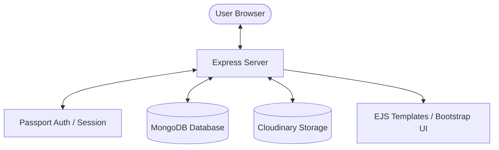

# 📸 SP PHOTOS - Modern High-Resolution Image Sharing Platform


**SP PHOTOS** is a feature-packed, production-ready full-stack web application for discovering, searching, uploading, and managing high-resolution photography. Built with Node.js, Express, MongoDB, EJS, and Cloudinary.

---

## ✨ Features

- 🔐 **User Authentication & Authorization**: Secure signup, login, and session persistence using Passport.js.
- 🖼️ **Cloudinary Image Storage**: Direct high-speed cloud upload and storage for optimized media distribution.
- 🏷️ **Category & Tag Exploration**: Browse photos by categories (*Nature*, *Animals*, *Anime*, *Universe*, *Other*) or filter by custom tags.
- 🔍 **Full-Text & Tag Search**: Perform searches across titles, categories, and tags.
- 👤 **Owner Management**: Uploader tracking with edit/delete authorization checks.
- 🎨 **Modern Responsive UI**: Clean glassmorphism header, responsive image masonry grid, hover overlays, live upload previewer, and confirmation modals.
- ⚡ **Performance Optimized**: Asset compression, optimized database indexes, and efficient lean queries.

---

## 🛠️ Tech Stack

- **Backend Framework**: Node.js & Express.js (v5)
- **Database**: MongoDB & Mongoose ORM
- **Authentication**: Passport.js with Local Strategy (`passport-local-mongoose`)
- **Cloud Storage**: Cloudinary API (`multer-storage-cloudinary`)
- **Frontend / Templating**: EJS & EJS-Mate layouts
- **Styling & UI**: Bootstrap 5.3, Custom CSS3, FontAwesome 6
- **Validation & Utilities**: Joi Schema Validation, Compression, Method-Override

---

## 🏗️ System Architecture



---

## 📁 Project Structure

```text
SP_PHOTO/
├── cloudConfig.js         # Cloudinary SDK & Multer Storage Configuration
├── app.js                 # Express Application Entry Point & Server Setup
├── middleware.js          # Authentication, Ownership, & Validation Middlewares
├── schema.js              # Joi Data Validation Schemas
├── controllers/           # Route Controller Logic
│   ├── images.js          # Photo CRUD & Search Controllers
│   └── users.js           # Authentication Controllers
├── models/                # Mongoose Database Models
│   ├── image.js           # Photo Schema & Indexes
│   └── user.js            # Passport User Schema
├── routes/                # Express Route Handlers
│   ├── image.js           # Photo Routes (/images)
│   └── user.js            # Auth Routes (/login, /signup, /logout)
├── public/                # Static Client Assets
│   ├── css/style.css      # Custom UI Stylesheet
│   └── js/script.js       # Client Validation & Live Upload Preview Script
├── views/                 # EJS Templating Engine Views
│   ├── includes/          # Modular Navbar, Hero, Footer Components
│   ├── layouts/           # Master Boilerplate Layout
│   ├── listings/          # Index, Show, New, Edit, Search Views
│   └── users/             # Login & Signup Views
├── .env.example           # Environment Configuration Template
└── package.json           # Project Dependencies & Scripts
```

---

## 🚀 Quick Start & Local Setup

### Prerequisites
- [Node.js](https://nodejs.org/) (v18 or higher)
- [MongoDB](https://www.mongodb.com/) (running locally or a MongoDB Atlas URI)
- [Cloudinary Account](https://cloudinary.com/) (for cloud image storage)

### Installation Steps

1. **Clone the Repository**
   ```bash
   git clone https://github.com/your-username/SP_PHOTO.git
   cd SP_PHOTO
   ```

2. **Install Dependencies**
   ```bash
   npm install
   ```

3. **Configure Environment Variables**
   Create a `.env` file in the root directory by copying `.env.example`:
   ```bash
   cp .env.example .env
   ```

   Fill in your credentials in `.env`:
   ```env
   PORT=3000
   MONGO_URL=mongodb://127.0.0.1:27017/SP_PHOTO
   SESSION_SECRET=your_secret_session_key
   CLOUD_NAME=your_cloudinary_cloud_name
   CLOUD_API_KEY=your_cloudinary_api_key
   CLOUD_API_SECRET=your_cloudinary_api_secret
   ```

4. **Run Database Seed (Optional)**
   ```bash
   node init/index.js
   ```

5. **Start the Application**
   ```bash
   # Production mode
   npm start

   # Development mode (with nodemon)
   npm run dev
   ```

   Open your browser and navigate to `http://localhost:3000`.

---

## 🛡️ Security & Environment Audit

- ✅ `.env` is ignored by `.gitignore` to prevent credential exposure.
- ✅ Sensitive session secrets and API credentials use environment variables.
- ✅ Image upload endpoints check user authentication and file extension constraints.
- ✅ Mutating routes (PUT / DELETE) strictly verify owner/admin authorization.

---

## 📄 License

This project is licensed under the **ISC License**. Feel free to use and customize!
